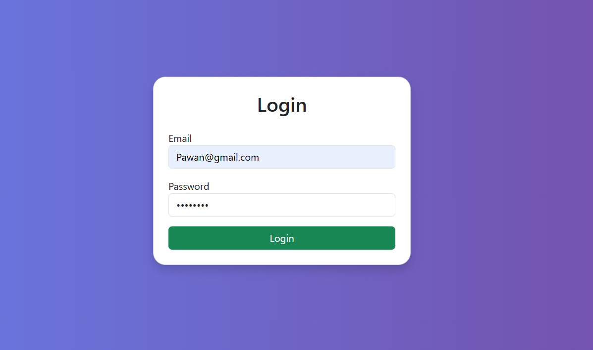
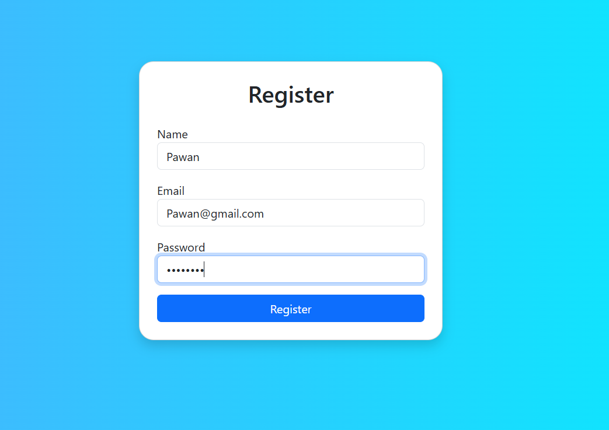
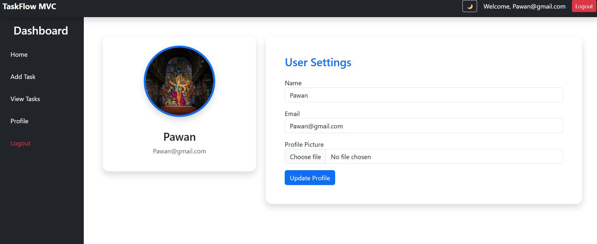
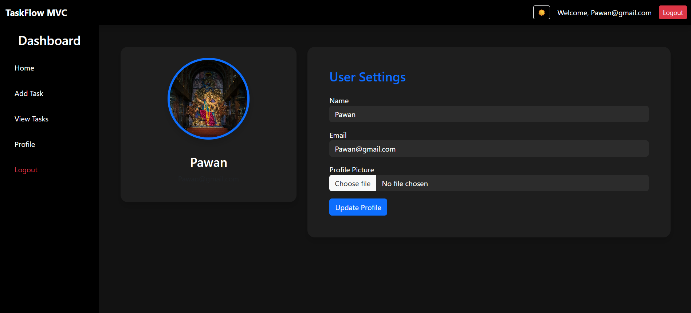

# Smart User Portal | Java Servlet JSP MVC Project

A modern Task Management Web Application built using Java Servlet, JSP, JDBC, MySQL, and Bootstrap following MVC Architecture.

---

## Features

- User Authentication (Login/Register)
- Session Management
- Add / Edit / Delete Tasks
- Search & Filter Tasks
- AJAX Live Search
- Dashboard Analytics
- Task Status Charts
- Dark Mode Toggle
- User Profile Settings
- Profile Image Upload
- Responsive Bootstrap UI
- MVC Architecture
- JDBC + MySQL Integration

---

## Tech Stack

### Backend
- Java
- Servlet
- JSP
- JDBC
- MySQL

### Frontend
- HTML
- CSS
- Bootstrap 5
- JavaScript
- AJAX

### Tools
- Eclipse IDE
- Apache Tomcat
- Maven
- Git & GitHub

---

## Highlights

- Modern Responsive UI
- Real-time AJAX Search
- Dark Mode Support
- Profile Image Upload
- Dashboard Analytics
- Pagination System
- MVC Architecture

## Project Structure

```bash
src/main/java/com/smart
│
├── controller
├── dao
├── model
└── db

src/main/webapp
│
├── views
├── components
├── uploads
└── assets
```

## Screenshots

### Login Page


### Register Page


### Dashboard


### Tasks Page


### Profile Page


### Dark Mode


---

## What I Learned

- MVC Architecture
- JDBC Connectivity
- Session Handling
- Servlet & JSP Development
- CRUD Operations
- AJAX Integration
- File Upload Handling
- Responsive UI Design
- Maven Project Management

## Database Setup

Run the `database.sql` file in MySQL.

Update database credentials inside:

```bash
DBConnection.java
```

---

## Run Project

1. Clone Repository

```bash
git clone https://github.com/your-username/smart-user-portal.git
```

2. Import Project in Eclipse

```bash
File → Import → Existing Maven Project
```

3. Configure Tomcat Server

4. Run Project

---

## Future Improvements

- Forgot Password
- Email Verification
- REST APIs
- JWT Authentication
- PDF Export

---

## Author

### Manas Suryavanshi
Aspiring Java Backend Developer
